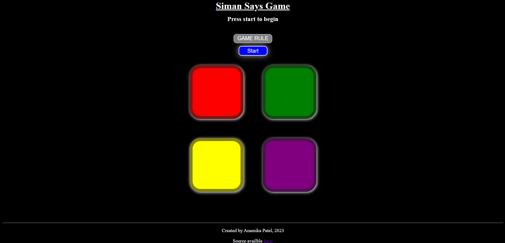

# Simon Says Game

## Description

This repository contains the code for a simple Simon Says game implemented using HTML, CSS, and JavaScript. Simon Says is a memory game where the player must follow a series of randomly generated color. The game provides a fun and interactive way to test and improve memory and concentration skills.

## Features

- Randomly generated sequences of colors.
- Progressive difficulty levels as the game progresses.
- User-friendly interface with clear instructions for playing.
- Score tracking to keep track of the player's performance.

## How to Play
- Start the game by clicking the "Start" button.
- Simon will play a sequence of colors.
- Remember the sequence.
- Click or tap the colors in the same order as Simon played them.
- If you make a mistake, the game will end, and your score will be displayed.

## Technologies Used
- HTML
- CSS
- JavaScript
## Authors
- Anamika Patel Email: anamikapatel817@gmail.com

## Demo
URL: [https://anamika024.github.io/Simon-Says-Game/?](https://anamika024.github.io/Simon-Says-Game/?)

